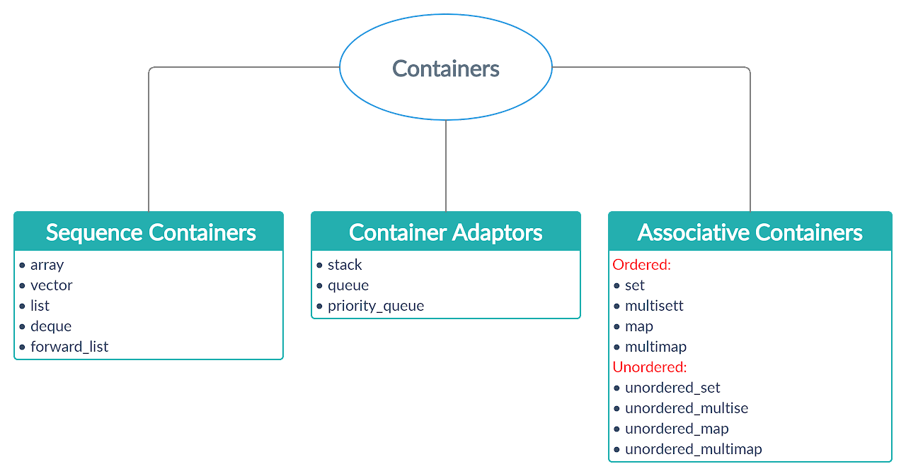

# Week #2
 
  * Starting from this Week to another 3 Weeks We will discuss the containers in c++ and some important Topics 

   
   


## 1 - important videos :

  * Measuring Algorithms Perfromance - 1 : [video](https://youtu.be/EQzmtn4PzYQ) 

  * Measuring Algorithms Perfromance - 2 : [video](https://youtu.be/ZNYQrKpR42g) 
  
  * Common Errors Regularly check : [Blog](https://docs.google.com/document/d/11BWI1fSlaeik-yEncWj06_RNOAox47qZTgN_kGJQcvs/edit ) 

---
## 2- Deque - Queue - Priority Queue

*  Deque : [video](https://youtu.be/PPFhtX23oXc)

*  Queue : [video](https://youtu.be/iLJXB9Daeq8)

*  Priority Queue :  [video](https://youtu.be/0zr0JqSw7ic)


---

## 3- Stack

* Stack : [video](https://youtu.be/9r7IDtX5KS4)
 
* Balanced Parentheses Using Stack {([ ])} : [video](https://youtu.be/PLvD3pHaWHQ)

* Expression Evaluation Using Stack : [video](https://youtu.be/Q4X7pZ5pyA4)

* Infix To Postfix Using Stack : [video](https://youtu.be/xhcChs9jijM)


---

## 4- Pairs & Struct & compare Fun

* Pair : [video](https://youtu.be/ucQnEO0MSSs)

* Struct : [video](https://youtu.be/1oB0Tz3ITjY)

* Compare Fun : [Blog](https://youtu.be/1oB0Tz3ITjY)

* Sorting - Compare functions : [video](https://youtu.be/_9Rrq0q51BQ)

## 5- If you have a little knowledge of OOP , Important

* Operator Overloading in C++ : [Blog](https://www.geeksforgeeks.org/operator-overloading-c/)

* if we have array of struct *for ex* we can sort this array by Operator Overloading : 

* For example, if we have N students and we want to store the grades of each student in five subjects and we want to sort them based on the total of five subjects.

```cpp
#include <bits/stdc++.h>
using namespace std;
struct Student{
    string name;
    int grade[5];
    bool operator<(Student&x){
        int total1 = accumulate(this->grade , this->grade+5,0) ;
        int total2 = accumulate(x.grade , x.grade+5,0);
        return total1>total2;
    }
};
int main(){
    //freopen("ans.txt","r",stdin);
    int n;
    cin >> n;
    vector<Student> arr(n);
    for (int i = 0; i < 2; ++i) {
        cin>>arr[i].name;
        for (int&j:arr[i].grade)
            cin>>j;
    }

    sort(arr.begin(),arr.end());

    for (int i = 0; i < n; ++i)
        cout << arr[i].name << '\n';
    
}

```


## 6 - Binary Search & Built in functions

* Binary Search How is Work ? : [video](https://youtu.be/qxhfkoDGGZc).

* Built in functions : [video](https://youtu.be/ZIYx0mmxuxs).

