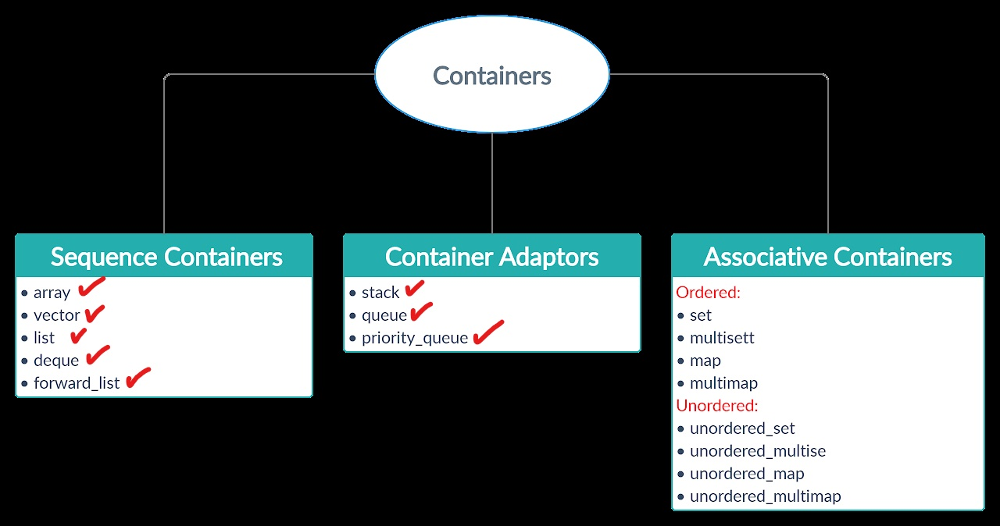

# Week #3
    
   

#### As you can see we finished half of them and now we continue ...

## Pointers ?  -if you know it u can skip this part - 
   *   pointer part 1 : [video](https://youtu.be/f7I4cnJ5KJo)
   *   pointer part 2 : [video](https://youtu.be/ibSjFL607QA)

---

## 1- Stack 
 * Video : [link](https://www.youtube.com/watch?v=9r7IDtX5KS4)
 * Blog  : [link](https://www.geeksforgeeks.org/stack-in-cpp-stl/)
---
## 2- Queue
 * Video : [link](https://www.youtube.com/watch?v=iLJXB9Daeq8)
 * Blog  : [link](https://www.geeksforgeeks.org/queue-cpp-stl/)
---
## 3- Priority queue
 * Video : [link](https://www.youtube.com/watch?v=0zr0JqSw7ic)
 * Blog  : [link](https://www.geeksforgeeks.org/priority-queue-in-cpp-stl/)
---
## 4- List
 * Video : [link](https://www.youtube.com/watch?v=U2oXdm4PfeQ)
 * Blog  : [link](https://www.geeksforgeeks.org/list-cpp-stl/)
---
## 5- Forward list
 * Video : [link](https://www.youtube.com/watch?v=hp7BCTdEDFs)
 * Blog  : [link](https://www.geeksforgeeks.org/forward-list-c-set-1-introduction-important-functions/)
---

## By this session we finished sequence containers and container adaptors .. the associative containers are left to teh next session

