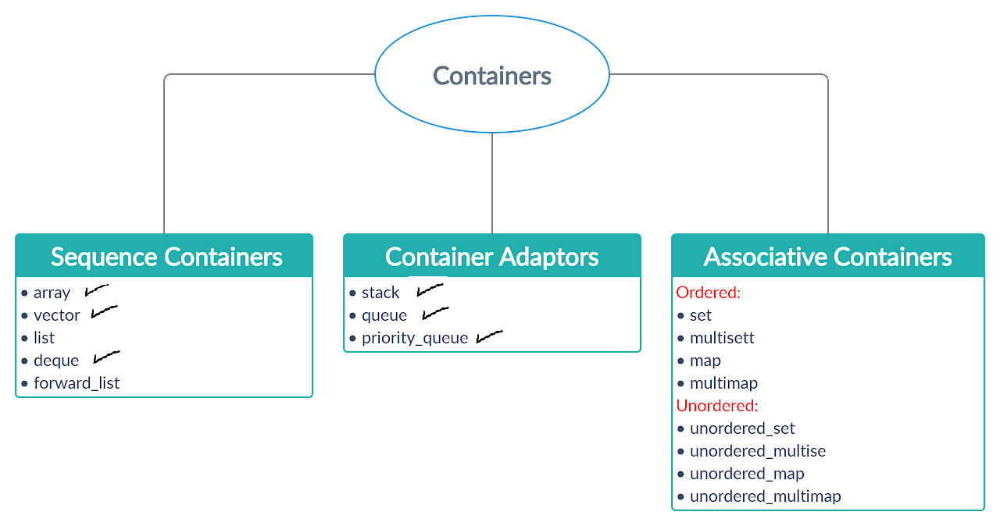

# Week #2
 
 #### I think after last week you can now understand what containers are 

   
   

#### As you can see we finished half of them and now we continue ...
## 1 - important videos :

*  we will update this part later
  
---
## 2- Lists  
*  Pointers ?  -if you know it u can skip this part - 
   *   pointer part 1 : [video](https://youtu.be/f7I4cnJ5KJo)
   *   pointer part 2 : [video](https://youtu.be/ibSjFL607QA)
 
*  Linked List : 
   *  Introduction To Linked List : [video](https://youtu.be/t7WnaypBoNw)
   *  Linked List Insertion : [video](https://youtu.be/t7iviFyL3K4)
   *  Removeing in Linked List : [video](https://youtu.be/_v8lL7zMlFc)
   *  Linked List Reverse,Search : [video](https://youtu.be/8kvQ-O10h4k)
   *  Doubly Linked List : [video](https://youtu.be/9xtRgr2V2mY)
#### After you finish these videos, I think you can create your own STLs    
*  Linked List As STLs:
   *  Forward List : [video](https://youtu.be/hp7BCTdEDFs)
   *  List : [video](https://youtu.be/U2oXdm4PfeQ)

---

## 3- Set

* Set : [video](https://youtu.be/Yg7dpbXhhlY) - [Set Blog ](https://www.geeksforgeeks.org/set-in-cpp-stl/) - [multiSet Blog](https://www.geeksforgeeks.org/multiset-in-cpp-stl/)
 
* Unordered Set & Unordered Multiset : [video](https://youtu.be/m9t4ORIMCro) - [Unordered Multiset Blog](https://www.geeksforgeeks.org/set-in-cpp-stl/) -  [Unordered Set Blog](https://www.geeksforgeeks.org/unordered_set-in-cpp-stl/)

* Ordre Set : [Set Blog](https://www.geeksforgeeks.org/ordered-set-gnu-c-pbds/)

#### be carful when we need to use binary search and it's method we use Set.lower() - set.upper() *Don't use lower(set.begin(),set.end (), )* .     

---

## 4- Sorting Algothims

* selection sort : [video](https://youtu.be/EnodMqJuQEo) - [Blog](https://www.geeksforgeeks.org/selection-sort/) 

* Bubble Sort  : [video](https://youtu.be/pIEGHDZHOCk) - [Blog](https://www.geeksforgeeks.org/bubble-sort/) 

* Insertion Sort : [video](https://youtu.be/JecAk1FAOck) - [Blog](https://www.geeksforgeeks.org/insertion-sort/)

* Quick Sort : [video](https://youtu.be/lOB2TIwBiX8) - [video](https://youtu.be/EdVKzzlInFI) - [Blog](https://www.geeksforgeeks.org/quick-sort/)

## 6 - String Built in functions

* geeksforgeeks : [Blog](https://www.geeksforgeeks.org/stdstring-class-in-c/).
